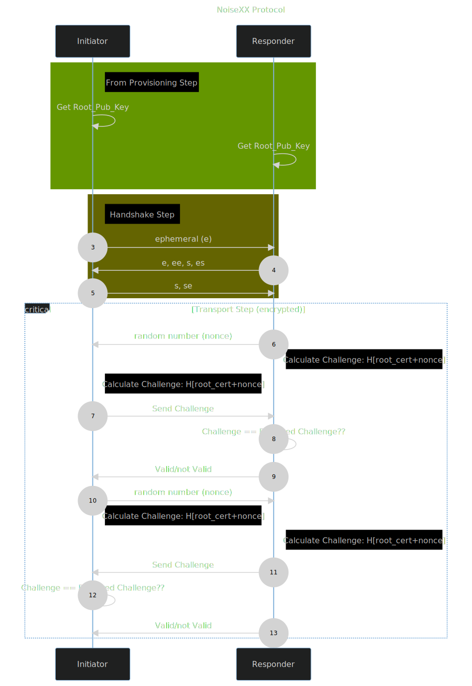

# Authentication with noise xx protocol
The Noise XX protocol is a secure, lightweight, and flexible protocol for encrypted communication. It is based on the Diffie-Hellman key exchange algorithm and uses a variety of cryptographic primitives to provide strong security guarantees. Noise XX is designed to be easy to implement and use, making it ideal for a wide range of applications.
Noise XX provides:
* **Security**: Noise XX provides strong security guarantees against a variety of attacks, including man-in-the-middle attacks, eavesdropping, and denial-of-service attacks.
* **Lightweight**: Noise XX is a lightweight protocol that can be implemented on a variety of devices, including low-power embedded systems.
* **Flexibility**: Noise XX is a flexible protocol that can be adapted to a wide range of communication scenarios.

 
### Tokens:
The protocol defines a series of tokens. 
* "**e**": The sender generates a new ephemeral key pair and stores it in the e variable, writes the ephemeral public key as cleartext into the message buffer, and hashes the public key along with the old h to derive a new h.
* "**s**": The sender writes its static public key from the s variable into the message buffer, encrypting it if k is non-empty, and hashes the output along with the old h to derive a new h.
* "**ee**", "**se**", "**es**", "**ss**": A DH is performed between the initiator’s key  pair (whether static or ephemeral is determined by the first letter) and the responder’s key pair (whether static or ephemeral is determined by the second letter). The result is hashed along with the old ck to derive a new 
ck and k, and n is set to zero.

### Steps:
Noise XX protocol consist in three main steps:
* **Handshake**: The Noise XX handshake is a two-way process that allows the two parties to establish a shared secret key. The handshake is secure against man-in-the-middle attacks.
* **Encryption**: Noise XX uses a variety of cryptographic primitives to encrypt data, including symmetric encryption, asymmetric encryption, and authentication.
* **Transport**: Noise XX uses a transport layer protocol to encapsulate encrypted data. The transport layer protocol provides reliable delivery of data and flow control.


## Proof of Concept

In this proof of concept, we use the Noise XX protocol to establish a secure link. 
Initially, the nodes are pre-provisioned with a _root_certificate_. The nodes will use this information as a challenge/response to authenticate other node.



# Run 
run the test cases
```bash
python3 test-cases.py
```
Expected output
```bash
> Valid Certificate
> Valid Certificate
Plaintext decrypted on server:  b'Hello'
Plaintext decrypted on client:  b'World'

```